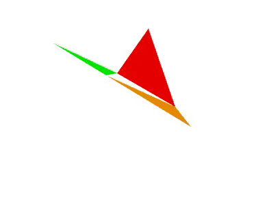

# VPython Animations

Simple VPython simulation for visualizing 2D-to-3D triangle folds.



## ▶️ Demo

▶️ [Watch the Folding Demo](looping_folds.mp4)


## Run It

```bash
pip install vpython
python looping_folds.py
